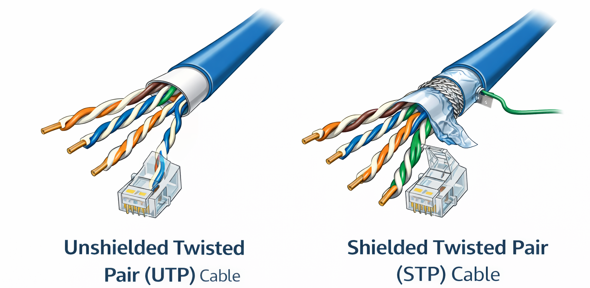

**Who is this chapter for?**

The chapter is explicitly intended for CPSA candidates and penetration
testers, as success in their role requires fluency in the **TCP/IP
protocol suite**. This fluency is crucial because the protocol suite
dictates how systems interact and provides the essential context needed
for identifying exploitable security weaknesses. Security professionals
must delve beyond simple computer network knowledge to understand how
vulnerabilities manifest when protocols malfunction or are deliberately
abused, for example, exploiting TCP\'s connection management protocols
via spoofing attacks or leveraging weaknesses in the network protocols
to perform man-in-the-middle attacks. Penetration testing, which
requires launching real attacks, necessitates comprehensive
protocol-level knowledge to translate subtle flaws, such as weaknesses
in packet fragmentation or the absence of internal integrity checks in
IP datagrams, into strategic compromises that achieve the defined
assessment goals.

**Learning Objectives**

By completing this chapter, you will be able to:

- Understand the Criticality of Network Knowledge for Penetration
  Testers

- Identify and Analyse Core Network Components and Devices

- Differentiate Network Media, Services, and Users

- Compare Network Types and Topologies

- Understand Network Models and Layered Security

- Detail IPv4 and IPv6 Addressing and Operation

- Analyse Transport Layer Protocols (TCP/UDP)

- Explain ICMP Functionality and Security Concerns

- Describe Traditional and Modern Network Segmentation

**Exam Objectives**

  ---------------------------------------------------------------------------
  **Skill   **Skill Name**        **Coverage**   **Depth**          **Exam
  ID**                                                              %**
  --------- --------------------- -------------- ------------------ ---------
  B1        IP Protocols          ✅ FULL        Comprehensive      High

  B2        Network Architecture  ✅ FULL        Comprehensive      Medium
  ---------------------------------------------------------------------------

**Why is understanding computer networks essential for penetration
testers?**

The TCP/IP suite is the core protocol suite of the Internet, defining
the fundamental methods for data delivery, addressing, and
configuration. For a penetration tester, fluency in this protocol suite
is critical because it dictates how systems interact and provides the
context for identifying exploitable security weaknesses. IP itself
offers a best-effort, connectionless datagram service that inherently
lacks reliability or security mechanisms, which upper layers must
address. Security professionals must delve beyond simple IT knowledge to
understand how vulnerabilities manifest when protocols malfunction or
are deliberately abused, for example, exploiting TCP\'s connection
management protocols via spoofing attacks that target the connection
4-tuple, or leveraging weaknesses in the Address Resolution Protocol
(ARP) to redirect traffic and perform man-in-the-middle attacks.
Penetration testing, which involves launching real attacks and
exploiting vulnerabilities, requires comprehensive protocol-level
knowledge to translate subtle flaws, such as weaknesses in packet
fragmentation or the absence of internal integrity checks in IP
datagrams, into strategic compromises that achieve the assessment\'s
defined goals.

**Defining the Network**

A network comprises interconnected systems that enable communication and
data exchange across local and wide-area networks. At its core, the
network operates using the TCP/IP protocol suite, which provides the
standard language for data delivery, configuration, and naming.

{width="4.819378827646545in"
height="2.8231288276465443in"}

**Network Components**

The network components span hardware, software, transport mechanisms,
and human roles. Mainly, there are four main types of network
components: (1) Network Devices, (2) Network Media, (3) Network
Services, and (4) Users.

{width="4.868825459317585in"
height="1.4017388451443569in"}

**Network Devices**

Network devices comprise all hardware required for communication and
interaction within a computer network. This category is commonly divided
into End-points and Infrastructure devices. **End-points** are the
devices on which digital data is automatically processed. These
typically include devices such as workstations, laptops, tablets,
printers, and mobile phones.

**Infrastructure Devices** form the backbone of the network, controlling
data flow, segmentation, and access. These critical systems include
network access, intermediary, and security devices.

**Examples of Network Access Devices**

- **Hubs**: Hubs operate at Layer 1 (Physical). A legacy device that
  interconnects network components by receiving data (bits) on one port
  and regenerating and repeating it out all other ports. Hubs are
  inherently inefficient and insecure because all connected devices
  share a single collision domain. A penetration tester should recognise
  that capturing traffic on a hub requires minimal effort since all
  communications are flooded to every port.

- **Bridges**: Operate at Layer 2 (Data Link). Used to join two or more
  local network segments and make forwarding decisions based on the
  destination Media Access Control (MAC) address. While hubs create
  multiple collision domains, bridges route all broadcast frames and
  belong to a single broadcast domain. They are largely obsolete, having
  been replaced by modern switches.

- **Switches**: Operate at Layer 2 (Data Link). Learns which devices
  (hosts) reside on which ports by observing the source MAC address of
  incoming frames. Forwards unicast traffic specifically to the correct
  destination port. Switches are core infrastructure devices;
  penetration testers must examine their features, such as VLANs, which
  segment broadcast domains and require Layer 3 routing to traverse.
  Vulnerabilities such as MAC address table corruption and VLAN hopping
  exploit the switch\'s traffic management at this level. They typically
  support critical analysis functions, such as port mirroring (SPAN
  ports), to facilitate traffic inspection.

- **Wireless Access Points (WAPs)** primarily operate at Layer 2 (Data
  Link). Interconnects wireless clients to a wired Local Area Network
  (LAN) using radio waves. All associated wireless devices are on the
  same shared network segment (collision domain). A primary concern is
  rogue access points (APs) or \"evil twins,\" which attackers can
  deploy to deceive legitimate users into connecting, thereby
  facilitating traffic interception. Wireless security assessment
  (WPA2/WPA3) is mandatory.

**Examples of Intermediary Devices**

- **Routers**: Operate at Layer 3 (Network). Determines packet paths
  based on logical Internet Protocol (IP) addresses and information
  stored in its routing table. Routers define the network perimeter and
  logical network segregation, forming the boundaries of collision and
  broadcast domains. Penetration Testing must focus on identifying
  misconfigured Access Control Lists (ACLs) and exploiting
  vulnerabilities in routing protocols to disrupt service or gain
  unauthorised access.

- **Wireless Routers**: Combines the functions of a router, a switch,
  and a wireless access point, frequently implementing Network Address
  Translation (NAT) or Port Address Translation (PAT). The NAT/PAT
  function is critical to perimeter security, rewriting internal private
  IP addresses to external public addresses. Penetration testing
  involves assessing the rigidity of this boundary and verifying that
  internal addresses or services are not unintentionally exposed to the
  public Internet.

Remember these key points:

- **Hub:** 1 Collision Domain, 1 Broadcast Domain.

- **Switch:** *N* Collision Domains (per port), 1 Broadcast Domain.

- **Router:** *N* Broadcast Domains.

**Examples of Security Devices**

- **Firewalls**: Operate across multiple layers (typically Layer 3
  through Layer 7). Controls network traffic flow between security zones
  (e.g., inside/outside/DMZ) according to predefined rule sets or Access
  Control Lists (ACLs). Can be stateless (packet filtering) or stateful
  (session-aware). Firewalls are the primary defence component at the
  network perimeter. Testers must identify weak firewall rules (e.g.,
  overly permissive PERMIT IP ANY ANY) or exposed management interfaces,
  which present a known attack vector. Next-Generation Firewalls (NGFWs)
  consolidate functions like intrusion prevention, VPN, and filtering to
  enhance perimeter defence.

- **Intrusion Detection and Prevention Systems (IDPSs)**: Typically
  operate across Layers 3-7. Detects and reports malicious network
  activity. Intrusion Detection Systems (IDSs) are passive monitors,
  whereas Intrusion Prevention Systems (IPSs) are active, residing
  inline to block malicious traffic immediately. Uses signature, policy,
  or anomaly-based detection methods. IDPS deployment is essential for
  continuous monitoring and the detection of Advanced Persistent Threats
  (APTs). IDPS deployment, especially, must be carefully considered due
  to the inherent risk of disrupting legitimate services if
  misconfigured.

**Network Media**

Network media define the physical or electromagnetic pathways used to
transfer data between devices. The primary classification divides media
into physical (Guided) and wireless (Unguided) types:

**Wired (Guided) Media**: Guided media are physical cables or conductors
that confine the transmission path, offering greater reliability and
stronger interference resistance than wireless alternatives. There are
two types of wired media: Copper and Fibre. Copper cables can be either
coaxial or twisted pair.

**Twisted-Pair Cable (Copper):** The most common media type in modern
LANs, consisting of individual insulated copper strands twisted into
pairs. There are two types of twisted-pair cables: Shielded (STP) and
Unshielded (UTP). UTP cable types vary significantly in their
data-carrying capacity and are crucial specifications for penetration
testers.

- **Category 5 (CAT 5):** Commonly used for 100BASE-TX networks at 100
  Mbps, although it can support ATM traffic at 155 Mbps.

- **Category 5e (CAT 5e):** An enhanced version of CAT 5, commonly used
  for 1000BASE-T (Gigabit Ethernet) networks at 1 Gbps, offering reduced
  crosstalk.

- **Category 6 (CAT 6):** Also commonly used for 1000BASE-T networks.
  Category 6a (augmented Cat 6) supports speeds up to 10 Gbps
  (10GBASE-T) for distances up to 100 metres.

{width="5.1875in"
height="2.536111111111111in"}

**Fibre-Optic Cable (Fibre):** This transmits data using light pulses
through optical fibres, typically made of glass. Fibre is immune to EMI
and generally supports longer distances and higher data-carrying
capacity than copper. []{dir="rtl"} There are two types of Fibre cables:

1.  **Multimode Fibre (MMF):** Has a larger core diameter that allows
    light pulses to travel multiple paths (modes). This can lead to
    **multimode delay distortion** (where bits arrive out of order),
    thereby limiting the distance over which MMF can be used.

2.  **Single-Mode Fibre (SMF):** Has a small core diameter, permitting
    only one mode of propagation, mitigating distortion and supporting
    longer distances.

{width="5.243055555555555in"
height="2.3543339895013125in"}

**Wireless (Unguided) Media**: Unguided media use electromagnetic waves
(e.g., radio waves) to propagate through the air, providing mobility and
flexibility. The most common standard for wireless LANs (WLANs) is
defined by IEEE 802.11. Wi-Fi primarily operates in the 2.4-GHz and
5-GHz Industrial, Scientific, and Medical (ISM) bands.

**Network Services**

Network services constitute the fundamental protocols and applications
that enable data exchange and configuration management across the
infrastructure. The core framework is the TCP/IP protocol suite, which
governs data delivery, addressing, naming, and configuration. Essential
services include the Domain Name System (DNS), which maps domain names
to IP addresses, and the Dynamic Host Configuration Protocol (DHCP),
which dynamically assigns configuration parameters (such as IP
addresses) to hosts. Security monitoring relies heavily on protocols
such as Simple Network Management Protocol (SNMP) to collect data on
utilisation and configuration from managed devices. Penetration testers
must determine whether unnecessary services or open ports are exposed,
thereby creating exploitable surfaces.

**Users**

The human element remains a crucial component of networks, categorised
primarily by its level of interaction.

**End-users:** End users are consumers of network services (e.g.,
standard authenticated users) and are routinely targeted by social
engineering attacks to bypass technical controls and obtain credentials.

**Technical users**: Technical users include system administrators,
network teams, security analysts, and penetration testers. These
individuals typically hold privileged access to configure and maintain
critical infrastructure. Effective defence necessitates training all
users to recognise and report suspicious activity, while strict
governance must regulate the high privileges held by technical staff to
prevent misuse or internal compromise.

**Types of Networks**

There are various types of networks, classified by scope, boundaries,
trust levels, and potential attack vectors, that are relevant to any
security assessment. Networks are commonly categorised by their
geographic scope, access control philosophy, and resource distribution
model.

**Resource Location Defined Networks**

These categories define how access and services are distributed among
connected endpoints. From this perspective, there are three types of
networks: Peer-To-Peer (P2P), Client-Server, and Hybrid.

1.  **Peer-to-peer (P2P)**: Devices act as both clients and servers,
    with peers sharing resources such as files or printers directly. In
    these networks, scalability is constrained by administrative
    burdens. Compromising a peer relies on exploiting the host\'s
    sharing functionality.

2.  **Client-Server**: A dedicated server provides resources (e.g.,
    files, web pages, email) to client devices. Administration is
    simplified as resources are consolidated. The central server is a
    single point of failure and thus a high-value target for privilege
    escalation or integrity attacks.

3.  **Hybrid**: Networks that integrate elements or traffic patterns
    characteristic of both peer-to-peer and client/server models.
    Security policy implementation must accommodate bidirectional
    resource sharing alongside centralised control mechanisms.

**Geographically Defined Networks**

This classification is based on the physical distance between
interconnected components, thereby distinguishing local from remote
attack capabilities. From this perspective, there are five network
types: PAN, LAN, CAN, MAN, and WAN.

1.  **Personal Area Network (PAN)**: Smallest scale; devices
    interconnected over a range of a few metres. Connectivity often
    employs technologies such as Bluetooth (WPAN) or USB. Primary vector
    for proximity attacks (e.g., local Bluetooth exploits) against
    mobile devices, which usually contain sensitive data.

2.  **Local Area Network (LAN)**: Confined to a regional area, such as
    within a single building or office, typically relies on Layer 2
    Ethernet (802.3) or Wi-Fi (802.11) technologies. Focus of internal
    penetration testing (Layer 2 ARP poisoning, VLAN hopping). Traffic
    within a LAN segment is often visible to adjacent systems.

3.  **Campus Area Network (CAN)**: Interconnects networks located in
    nearby buildings (e.g., industrial park or university campus). Acts
    as a high-speed backbone connecting multiple LAN segments, requiring
    robust security at the segmentation points (routers).

4.  **Metropolitan Area Network (MAN)**: Spans a metropolitan area,
    broader than a CAN but smaller than a WAN. Example technology: Metro
    Ethernet. Often involves third-party links, raising questions about
    shared infrastructure security and Service Level Agreements (SLAs).

5.  **Wide Area Network (WAN)**: Interconnects components that are
    geographically separated by large distances. Utilises technologies
    like Frame Relay, ATM, MPLS, or dedicated leased lines. Core target
    for testing routing protocols and VPN perimeter security. Assessed
    for link resilience and protocol integrity.

Trust Defined Networks

These categories relate to the administrative or security boundaries
that govern traffic access and routing. From this perspective, there are
three types of networks: Intranet, Extranet, and Internet.

1.  **Intranet**: A private network within an enterprise, usually
    isolated from the public Internet by a firewall. Often uses reserved
    private IP address ranges (RFC 1918 addresses like 192.168.x.x or
    10.x.x.x). In such networks, a penetration tester should simulate an
    attacker who has bypassed the perimeter, with a focus on system
    hardening, privilege escalation, and lateral movement.

2.  **Extranet**: A portion of an enterprise network accessible to
    authenticated external partners or associates, frequently secured
    using a VPN. In such networks, a penetration tester should focus not
    only on internal testing but also on external testing, including the
    security of the VPN gateway and remote access protocols, to prevent
    unauthorised access.

3.  **Internet**: The global collection of interconnected networks
    spanning the world. The Internet is the most dangerous network, with
    numerous types of malicious actors; accordingly, a penetration
    tester should focus on identifying publicly exposed services and
    vulnerabilities reachable via globally routable IP addresses.

**Network Topologies and Their Characteristics**

Network topologies describe the geometric arrangement of the
interconnected components (physical topology) and the conceptual pattern
of data flow (logical topology). Understanding these structures is
fundamental for identifying control points and potential failure
scenarios during penetration testing.

- **Bus Topology (Shared Media)**: A bus topology typically employs a
  single main cable running through the area, into which all network
  devices tap. This older architecture was widely used in early Ethernet
  networks (e.g., 10BASE5 and 10BASE2). Traffic arriving on one port is
  blindly repeated as raw bits out to all other ports. All devices are
  in a single collision and broadcast domain. Therefore, passive network
  sniffing of all traffic on the segment is trivial, as traffic is
  broadcast to all ports. This compromises **confidentiality** for
  unencrypted protocols (e.g., FTP, Telnet).

{width="6.5in"
height="1.3034722222222221in"}

- **Ring Topology (Legacy Structure)**: In a ring topology, data flows
  in a circular pattern, typically in a single direction, around a
  closed loop, visiting each connected device in turn. This model relies
  on devices taking turns transmitting, thereby avoiding the contention
  issues seen in bus topologies. Historically used in Token Ring
  networks, it was often physically wired as a star but maintained a
  logical ring flow. A single break in the ring, leaving only one loop,
  causes a network outage for all connected devices.

{width="2.2152777777777777in"
height="1.521583552055993in"}

- **Star Topology (Switched/Modern Default)**: In a star topology,
  devices radiate outward from a central point, typically a switch in
  modern LANs. It is the most prevalent physical LAN topology today. In
  this topology, traffic is intelligently forwarded based on destination
  MAC addresses learned and stored in the CAM table. Each port is a
  separate collision domain. This topology is susceptible to **CAM table
  overflow,** which forces the switch to flood traffic, enables passive
  sniffing, and supports **ARP cache poisoning**, which is used for
  active Man-in-the-Middle (MITM) attacks by injecting false MAC-IP
  mappings.

{width="3.8333333333333335in"
height="2.0907228783902014in"}

- **Mesh Topologies (WAN Focus)**: Mesh topologies are primarily used to
  describe the interconnectivity of remote sites over Wide Area Networks
  (WANs). There are two types of Mesh topologies: Full Mesh and Partial
  Mesh. In a Full Mesh, each remote site is connected directly to every
  other site via a dedicated link. Partial-Mesh combines the redundancy
  of a full mesh with the cost-effectiveness of simpler designs (e.g.,
  hub-and-spoke). Direct links are provisioned only between selected
  sites that require frequent communication or high resilience, with
  less critical traffic routed via intermediate sites.

{width="1.75in"
height="1.2429483814523186in"}

- **Point-to-Point (Dedicated Link)**: A direct, two-party connection
  between two distinct endpoints. This often refers to dedicated WAN
  links (such as T1 or optical links). In the application layer, this
  describes the communication flow between two peers that share
  resources directly without relying on a central server.

{width="3.4722222222222223in"
height="0.722341426071741in"}

**Ethernet (IEEE 802.3) Standard**

Ethernet forms the ubiquitous foundation for LANs, derived originally
from the industry-agreed-upon Ethernet II format and standardised by the
IEEE as 802.3. Early deployments, such as 10BASE5 (thicknet) and 10BASE2
(thinnet), used shared cables at 10 Mbps and employed the
contention-based Carrier Sense Multiple Access with Collision Detection
**(CSMA/CD)** protocol. This mechanism required stations to listen
before transmitting and, upon detecting a signal collision, to wait a
random time before retrying, ensuring that only a single frame traversed
the network at a time (half-duplex operation). Modern Ethernet, however,
primarily operates in a star topology using UTP cabling (e.g., Cat 5e,
Cat 6a) and is managed by switches. This transition enables full-duplex
operation, eliminating the need for CSMA/CD and significantly enhancing
scalability by dedicating a collision domain to each port.

The standard has continually evolved to increase bandwidth capacity:

- **Ethernet (10Base-T)**: 10 Mbps, typically over Cat 3.

- **Fast Ethernet (100BASE-TX):** 100 Mbps, typically over Cat 5/5e UTP.

- **Gigabit Ethernet (1000BASE-T):** 1 Gbps, over Cat 5e/6 UTP.

- **10 Gigabit Ethernet and higher:** Requires Cat 6a UTP for up to
  100m, or relies on Fibre-Optic cable (Single-Mode or Multimode) for
  greater distance and higher speeds, reaching 100 Gbps.

**Wi-Fi (IEEE 802.11) Standards**

Wireless Fidelity (Wi-Fi) is the primary standard for wireless LANs
(WLANs), utilising radio waves and typically operating in the **2.4 GHz
band** or the **5 GHz band**. Due to the difficulty of detecting signal
collisions in a shared wireless medium, Wi-Fi utilises **Carrier Sense
Multiple Access/Collision Avoidance (CSMA/CA)** to coordinate access to
the channel, resulting in half-duplex operation. Wi-Fi networks are
structured around an **Access Point (AP)** and its associated stations
(STAs), forming a Basic Service Set (BSS), which is often interconnected
via a Distribution Service (DS) to form an Extended Service Set
(**ESS**).

  ------------------------------------------------------------------------------
  Standard       Max Bandwidth    Frequency   Key Features (CPSA Relevance)
                 (Approx)         Band        
  -------------- ---------------- ----------- ----------------------------------
  **802.11b**    11 Mbps          2.4 GHz     Uses DSSS modulation; highly
                                              vulnerable to interference.

  **802.11g**    54 Mbps          2.4 GHz     Backward compatible with 802.11b;
                                              uses OFDM or DSSS.

  **802.11a**    54 Mbps          5 GHz       Uses OFDM; operates in less
                                              congested 5 GHz band.

  **802.11n**    \>300 Mbps       2.4 GHz / 5 Introduced **MIMO** (multiple
                 (w/bonding)      GHz         antennas) and channel bonding
                                              (40MHz).

  **802.11ac**   \>3 Gbps         5 GHz       Uses wider channels (MU-MIMO);
                                              successor to 802.11n.
  ------------------------------------------------------------------------------

  : Table 1 -- Wi-Fi Standards

Security evolved from the flawed **WEP** (Wired Equivalent Privacy)
through WPA (Wi-Fi Protected Access) and WPA2 (AES-based CCMP) to WPA3.
Authentication is managed either through a **Pre-shared Key (PSK)**
(Personal mode) or via the extensible framework of **IEEE 802.1X/EAP**
(Enterprise mode), utilising a backend authentication server such as
RADIUS. For optimal deployment, security professionals conduct site
surveys to select non-overlapping channels (e.g., 1, 6, and 11 in the
2.4 GHz band), ensure appropriate coverage overlap (10--15%), and
identify and mitigate sources of Radio Frequency Interference (RFI),
such as microwave ovens or cordless phones.

**Traditional Network Segmentation**

Traditionally, segmentation focuses on creating broad zones defined by
trust levels, enforced primarily at Layer 2 using switches and Layer 3
using routing devices:

- **Virtual LANs (VLANs):** VLANs achieve logical segmentation by
  isolating groups of hosts into separate Layer 2 broadcast domains,
  even if those hosts are connected to the same physical switch. To
  transit from one VLAN to another (e.g., from a Guest VLAN to a
  Production VLAN), traffic must be explicitly routed by a Layer 3
  device. This segregation limits the effectiveness of local Layer 2
  reconnaissance or attacks, such as ARP poisoning, to the VLAN scope.
  VLANs rely on the IEEE 802.1Q standard, which uses tags embedded in
  Ethernet frames to identify the VLAN association of traffic. However,
  VLAN implementations are notoriously vulnerable to VLAN hopping
  attacks, in which an attacker bypasses VLAN segmentation.

{width="2.429511154855643in"
height="1.3888888888888888in"}

- **Demilitarised Zone (DMZ):** A topological security zone used as a
  buffer, isolating systems that provide services to the untrusted
  external network (e.g., web or email servers) from the highly
  sensitive internal network. The DMZ is enforced by firewalls, which
  permit limited, specific traffic flows (e.g., HTTPS on port 443) to
  enter the zone from the Internet, while maintaining highly restrictive
  rules governing communication between the DMZ and the Internal
  Network.

{width="3.947694663167104in"
height="2.25in"}

🎯 **CPSA EXAM TIP 1**

Explain the security limitations of VLANs and why they are vulnerable to
Layer 2 bypass techniques. **Focus Area:** VLANs provide logical
segmentation by isolating groups of hosts into separate Layer 2
broadcast domains, using the IEEE 802.1Q standard for tagging. The
crucial weakness is that Layer 2 devices (switches) are typically
optimised for efficient forwarding rather than rigorous security. The
exam tests the knowledge that VLANs are notoriously vulnerable to **VLAN
hopping attacks**. This is a Layer 2 attack that bypasses logical
isolation, requiring traffic to be explicitly routed by a Layer 3 device
to ensure secure traversal of segmentation. This highlights that VLANs
alone are insufficient for robust network security and require Layer 3
enforcement (e.g., via firewall rules).

Micro-Segmentation

As network infrastructures have grown complex, often incorporating cloud
environments, microservices, and mobile devices, the traditional
broad-scope zones (DMZ/Internal) have proven insufficient to stop
sophisticated attackers capable of lateral movement once initial entry
is gained. This drove the evolution toward Micro-Segmentation within a
Zero Trust Architecture.

- **Micro-Segmentation:** This approach extends the principle of network
  segmentation to individual workloads or application services, often
  down to the container or microservice level. Micro-segmentation
  creates highly granular, application-specific security boundaries,
  treating even individual processes on a single host as separate
  network entities. This fine-grained isolation ensures that if one
  component is compromised, the attacker's ability to move laterally to
  the next, often loosely coupled, microservice is severely restricted.

- **Zero Trust Architecture (ZTA):** ZTA fundamentally shifts the
  security paradigm from defending the perimeter to implementing
  controls directly at the resource level, operating on the principle of
  \"never trust, always verify\". In a zero-trust environment,
  traditional security zones are considered inherently untrusted. Access
  is dynamically granted through continuous verification of identity,
  device posture (security posture), and contextual factors, regardless
  of whether the user is inside or outside the traditional perimeter.

**Network Protocols**

The foundational language that defines how systems interact is the
protocol, which establishes the structured rules and conventions
governing communication, ranging from the fundamental Transmission
Control Protocol/Internet Protocol (TCP/IP) suite for data delivery and
addressing to high-level application interactions. Protocols are
classified primarily as **standard protocols**, which are universally
recognised and typically defined by bodies such as the IETF through
publicly available Requests for Comments (RFCs), examples include TCP,
UDP, and ICMP, or **proprietary protocols**, which are specific to a
vendor or organisation, such as Cisco's CDP (Cisco Discovery Protocol)
or Microsoft's legacy authentication schemes. For the penetration
testers, mastering both types is critical, as inherent implementation
flaws and vulnerabilities in widely deployed standard protocols often
form the basis of external exploitation, whilst proprietary systems
present unique attack vectors that require tailored knowledge to
compromise security controls.

**The Protocol Stack**

The protocol stack serves as the architectural foundation for how
systems communicate, primarily defined by the abstract seven-layer Open
Systems Interconnection (OSI) model and the practical four-layer
Transmission Control Protocol/Internet Protocol (TCP/IP) stack. The
historical narrative of network architecture pivots on the divergence
between two key models: the abstract OSI reference model and the
practical TCP/IP suite. The OSI model, developed by the International
Organisation for Standardisation (ISO) starting in 1977, was conceived
as a comprehensive, seven-layer framework intended to standardise
interoperability across diverse vendor communication systems.
Concurrently, the TCP/IP suite emerged from the ARPANET Reference Model
(frequently referred to as the Department of Defence (DoD) model),
providing the fundamental protocols upon which all subsequent Internet
traffic would rely. Although TCP/IP\'s designers faced competition from
other architectures, it became the ubiquitous protocol suite,
demonstrating that the vast majority of digital estate traffic, both on
the public Internet and in internal corporate environments, is based on
its specifications.

**The OSI Reference Model**

The OSI reference model is the conceptual foundation for network
communication protocols, providing a seven-layer framework against which
various technologies can be logically categorised. The OSI model
arranges the layers from bottom to top:

**Layer 1 -- Physical Layer:** This layer is responsible for the
fundamental transmission of raw bits over the physical medium. Functions
here include defining the electrical and physical characteristics of the
network, managing bit synchronisation (synchronous/asynchronous
transmission), specifying wiring standards, and controlling bandwidth
usage (e.g., baseband or broadband). Devices operating at this layer,
such as hubs, merely receive and forward data without inspecting the
address field.

{width="4.291666666666667in"
height="2.970695538057743in"}

**Layer 2 -- Data Link Layer:** This layer manages node-to-node data
transfer across a local link. It is responsible for packaging data into
discrete **frames**, handling flow control, and managing error detection
using mechanisms such as a Cyclic Redundancy Check (CRC). The layer is
segmented into the Media Access Control (MAC) sublayer, which handles
physical addressing (MAC addresses), and the Logical Link Control (LLC)
sublayer, which manages connection services and synchronises
transmissions. Layer 2 devices, such as switches, make forwarding
decisions based on the destination MAC address.

**Layer 3 -- Network Layer:** This pivotal layer handles logical
addressing, primarily using the Internet Protocol (IP), and determines
the path for forwarding **packets** through interconnected networks
(routing). It manages packet switching and discovers routes to remote
destinations. Routers and multilayer switches operate at this level,
using routing tables populated by various sources (static, dynamic
routing protocols, or direct connections).

**Layer 4 -- Transport Layer:** Often seen as the functional boundary
between the upper and lower layers, this layer encapsulates higher-layer
messages into **segments**. It defines the end-to-end communication
nature: reliable and connection-oriented via Transmission Control
Protocol (TCP), which uses acknowledgements and flow-control techniques
such as windowing, or unreliable and connectionless via User Datagram
Protocol (UDP).

**Layer 5 -- Session Layer:** This layer is responsible for
establishing, managing, and terminating the logical dialogue, or session
(conversation), between applications on end systems.

**Layer 6 -- Presentation Layer:** This layer ensures that data is in a
format that is understandable to the application layer. Its functions
include data formatting (e.g., converting between ASCII and EBCDIC) and
encryption and decryption.

**Layer 7 -- Application Layer:** The topmost layer, providing services
that directly support user applications, such as network file sharing
(FTP) and electronic mail (SMTP/POP3). This layer also manages service
advertisement and initiates client-server interactions.

**The TCP/IP Model**

The TCP/IP stack typically consists of four layers, mapping concisely to
the corresponding functional groups in the OSI model:

{width="4.906336395450569in"
height="2.8541666666666665in"}

**Network Interface Layer:** This lowest layer, sometimes called the
Network Access Layer, encompasses the functions typically associated
with OSI Layers 1 (Physical) and 2 (Data Link). It defines how hardware
components interconnect and handle the fundamental frame exchange,
including physical addressing (MAC addresses). Protocols such as ARP
dynamically map IPv4 addresses to MAC addresses, a function critical for
local network discovery but susceptible to poisoning attacks.

**Internet Layer:** Corresponding directly to the OSI Network Layer,
this layer is responsible for logical addressing (IPv4 or IPv6) and for
determining the paths (routing) packets take through the internetwork.
The core protocol, IP, provides a best-effort, connectionless datagram
service; consequently, application-layer vulnerabilities often arise
from exploiting inherent IP limitations. IP forwarding operates on a
hop-by-hop basis, using a longest-prefix-match algorithm in the
forwarding table to determine the next router or host.

**Transport Layer:** This layer maps to OSI Layer 4 and is responsible
for managing end-to-end communication between applications using
well-known port numbers. It contains the principal protocols governing
reliability and connection states, such as TCP, UDP, and ICMP.

**Application Layer:** The topmost layer consolidates the functions of
the OSI Session, Presentation, and Application layers. It defines the
interface for end-user applications and manages specific services (such
as DNS, HTTP/HTTPS, and SSH) that run on top of transport protocols.
Vulnerabilities here, often found in the protocols used (e.g., insecure
Telnet or HTTP), are prime targets for penetration testers.

  -------------------------------------------------------------------------------------
  **TCP/IP Layer**  **OSI           **Key                    **Security Relevance**
                    Equivalence**   Protocols/Functions**    
  ----------------- --------------- ------------------------ --------------------------
  **Application**   L5, L6, L7      HTTP/S, SSH, DNS, FTP,   Exploiting
                    (Session,       LDAP.                    application-specific flaws
                    Presentation,                            (e.g., web server
                    Application)                             vulnerabilities, insecure
                                                             services), examining
                                                             authentication mechanisms,
                                                             and gathering intelligence
                                                             through exposed protocols.

  **Transport**     L4 (Transport)  TCP                      Targeting TCP connection
                                    (Connection-Oriented),   establishment (SYN
                                    UDP (Connectionless),    floods), exploiting
                                    and ICMP.                stateless UDP protocols
                                                             (amplification attacks),
                                                             and checking protocol
                                                             behaviour (e.g., flow
                                                             control implementation).

  **Internet**      L3 (Network)    IP (IPv4, IPv6), Routing Bypassing filtering
                                    protocols.               (ACLs), testing path MTU
                                                             discovery, IP spoofing,
                                                             and exploiting routing
                                                             logic to redirect traffic
                                                             (routing protocol
                                                             attacks).

  **Network         L1, L2          Ethernet, Wi-Fi, ARP,    Performing local attacks
  Interface**       (Physical, Data MAC Addressing, VLANs.   such as ARP cache
                    Link)                                    poisoning, sniffing
                                                             unencrypted traffic, and
                                                             testing VLAN segmentation
                                                             controls (VLAN hopping).
  -------------------------------------------------------------------------------------

  : Table 2 -- TCP/IP Model vs. OSI Model

🎯 **CPSA EXAM TIP 2**

Why must a penetration tester distinguish between local link-layer
attacks and attacks targeting Layer 3 routing protocols? **Focus Area:**
Network penetration testing relies heavily on understanding local
network discovery and traffic redirection. You must differentiate the
function of Layer 2 (Data Link) address resolution, using **ARP** in
IPv4 and **Neighbour Discovery Protocol (NDP)** in IPv6, from Layer 3
(Internet) routing decisions. Local attacks, such as ARP poisoning,
exploit ARP vulnerabilities to perform man-in-the-middle attacks on the
local segment. Higher-level attacks focus on exploiting vulnerabilities
in the actual routing logic or bypassing filtering (ACLs) to redirect
traffic across network boundaries.

**The IPv4 Protocol**

The IPv4 protocol operates at the Internet layer (Layer 3) of the TCP/IP
stack and provides a **best-effort, connectionless datagram delivery
service**. This foundational design means that IP does not inherently
guarantee reliability, flow control, sequencing, or error correction;
instead, these critical functions are delegated to upper-layer
protocols, such as TCP. All traffic originating from or destined for
TCP, UDP, ICMP, and IGMP is encapsulated within an IPv4 datagram.

**Key Header Components:**

The standard IPv4 header is typically 20 bytes long, although its length
varies when options are present. Essential fields within the header
define its function in routing and integrity:

- **Time-to-Live (TTL):** This field contains a value, set by the
  sender, that is decremented by one at every router hop. If the TTL
  reaches zero, the datagram is discarded, preventing packets from
  circulating endlessly in a routing loop.

- **Protocol:** A number indicating the encapsulated protocol carried in
  the payload (e.g., 6 for TCP, 17 for UDP, 1 for ICMP).

- **Header Checksum:** A 16-bit value calculated only over the IPv4
  header itself. Importantly, this checksum must be recalculated by
  every router that forwards the packet, primarily because the TTL field
  changes.

- **Fragmentation:** If a datagram exceeds the network segment\'s
  Maximum Transmission Unit (MTU), IP fragments the datagram into
  smaller packets for transport. This fragmentation capability differs
  from IPv6, in which fragmentation is handled only by the sending host.

{width="4.833333333333333in"
height="1.7290135608048993in"}

🎯 **CPSA EXAM TIP 3**

Why does the inherent design of the IPv4 header require upper-layer
protocols (like TCP) to ensure integrity, and how does fragmentation aid
evasion? **Focus Area:** IP provides only a best-effort, connectionless
datagram delivery service, meaning it inherently lacks reliability or
security mechanisms. Specifically, the **IPv4 Header Checksum** is
calculated only over the header and must be recalculated by every router
because the TTL field changes. This means IP provides no end-to-end
integrity check for the data payload, requiring protocols such as TCP to
compute a mandatory checksum over the pseudo-header and the data.
Furthermore, IPv4 supports fragmentation by intermediate routers if the
MTU is exceeded, a capability that attackers can leverage to bypass
simplistic filtering rules.

**IPv4 Addressing**

The IPv4 addressing scheme uses a fixed **32-bit address**, typically
represented using **dotted-decimal notation** (four decimal numbers,
known as octets, separated by periods). An IPv4 address is functionally
split into a network portion and a host portion, defined precisely by
the binary overlay known as the **subnet mask**.

- **Subnet Mask Function:** The subnet mask consists of consecutive 1s
  followed by 0s. The ones indicate the network and subnet bits, while
  the zeros indicate the host bits.

- **Notation:** Masks are commonly written in dotted-decimal format
  (e.g., 255.255.255.0) or in prefix notation (e.g., /24), where the
  number indicates the number of high-order network bits.

**CIDR and Address Allocation**

Historically, addresses were grouped into classes (A, B, C, D, & E),
each implicitly carrying a classful mask (/8, /16, /24). Today, however,
**Classless Inter-Domain Routing (CIDR)** is the prevailing model, which
disregards fixed class boundaries and allows address spaces to be
defined by flexible prefix lengths. **Subnetting** is the process of
dividing an IP address space into smaller, manageable subnets by
borrowing host bits to extend the prefix length. Although traditional
classful addressing (Classes A, B, and C) originally assigned default
network boundaries, contemporary networks universally rely on CIDR
notation, utilising the subnet mask prefix length to define network and
host portions.

  -------------------------------------------------------------------------
  Class     First      Use Case          Classful Mask    Classful Mask
            Octet                        (Dotted Decimal) (Prefix)
            Range                                         
  --------- ---------- ----------------- ---------------- -----------------
  **Class   1--126     Unicast/Special   255.0.0.0        /8
  A**                                                     

  **Class   128--191   Unicast/Special   255.255.0.0      /16
  B**                                                     

  **Class   192--223   Unicast/Special   255.255.255.0    /24
  C**                                                     

  **Class   224--239   Multicast         N/A              N/A
  D**                                                     

  **Class   240--255   Reserved          N/A              N/A
  E**                                                     
  -------------------------------------------------------------------------

  : Table 3 -- Legacy IPv4 Classes

Additionally, the following special ranges are relevant for internal
configuration and diagnostics:

- **Default Route**: The default route, which serves as the essential
  fallback path in an IP routing or forwarding table, uses the network
  destination 0.0.0.0. Its corresponding CIDR notation is 0.0.0.0/0.

- **Loopback Address:** The 127.0.0.0/8 network is reserved for
  loopback, primarily identifying the local host itself (typically used
  as 127.0.0.1).

- **APIPA/Link-Local:** The range **169.254.0.0/16** is used for
  Automatic Private IP Addressing (APIPA). These addresses are
  non-routable beyond the local subnet and are automatically
  self-assigned if a host fails to acquire an address via DHCP.

**Private IPv4 Address Ranges**

The ranges reserved under RFC 1918 for private addressing are not
routable on the public Internet and are commonly assigned by DHCP
servers to LAN hosts.

  ---------------------------------------------------------------------
  Address     Private IP Address Range      CIDR      Default Subnet
  Class                                     Prefix    Mask
  ----------- ----------------------------- --------- -----------------
  **Class A** 10.0.0.0 through              /8        255.0.0.0
              10.255.255.255                          

  **Class B** 172.16.0.0 through            /12       255.255.0.0
              172.31.255.255                          

  **Class C** 192.168.0.0 through           /16       255.255.255.0
              192.168.255.255                         
  ---------------------------------------------------------------------

  : Table 4 -- RFC 1918 Private IP Ranges

**Public (Globally Routable) IP Address Ranges**

Public IP addresses are globally unique and are allocated for use on the
Internet by entities such as ICANN and IANA. These are the addresses
that define an organisation\'s external attack surface. Public addresses
comprise all IPv4 addresses that do not fall within the private,
reserved, or multicast ranges. In the context of penetration testing,
systems using public addresses define the perimeter of the external
network. These exposed resources often reside within a **Demilitarised
Zone (DMZ)** and are the initial focus of testing exercises, while
non-routable addresses are contained within the internal network.

**The IPv6 Address**

The Internet Protocol Version 6 (IPv6) address is the successor to IPv4,
employing a significantly expanded 128-bit address space to address the
scalability limitations of its predecessor. It provides the foundation
for logical addressing in modern networks. An IPv6 address is 128 bits
long and is typically expressed in hexadecimal notation, partitioned
into eight fields, every four hexadecimal digits long, separated by
colons. Given that each hex digit represents 4 bits, this confirms the
total 128-bit length (4 bits per digit × 4 digits per field × 8 fields =
128 bits).

{width="5.444444444444445in"
height="1.4081047681539807in"}

To mitigate the unwieldy length of this format, standard abbreviation
rules are applied:

1.  **Omitting Leading Zeros:** Leading zeros within any of the eight
    fields can be suppressed.

2.  **Double Colon (::) Substitution:** A contiguous sequence of fields
    containing all zeros can be replaced by a double colon (::).
    Crucially, the double-colon notation may be used only once in any
    IPv6 address to prevent ambiguity.

Unlike IPv4, which relies on address classes (A, B, C) defined by the
value of the first octet, IPv6 addresses do not use this class-based
addressing scheme. Instead, contiguous address spaces are typically
defined using **prefix notation** (or slash notation), where a forward
slash is followed by the number of high-order bits used for the network
portion.

**Addressing Types and Deployment**

IPv6 supports three primary communication types, replacing the concept
of the IPv4 broadcast address entirely with multicast functionality:

1.  **Unicast Addresses**: A unicast address identifies a **single
    interface** and is used for standard one-to-one communication.

- **Globally Routable:** These addresses are unique across the Internet
  and are generally found within the prefix range **2000 to 3999**
  (first four hexadecimal characters).

- **Link-Local Addresses:** These addresses begin with **FE80**. They
  are automatically self-assigned by a host (SLAAC) and are
  non-routable, meaning they are usable only on the local network
  segment.

2.  **Multicast Addresses**: A multicast address identifies a group of
    interfaces and is intended for one-to-many communication. A sending
    host sends a single copy of a packet destined for the group address,
    and only devices that have explicitly joined the multicast group
    receive the stream. Multicast addresses are easily identifiable as
    they begin with the hexadecimal value **FF**. IPv6 eliminates the
    use of traditional broadcast addresses; instead, multicast is used
    to perform functions previously reliant on broadcast mechanisms.

- **Interface/Node-Local Multicast**: Used only for communication on the
  same physical host or device. Its prefix range is: FF01::/16.

- **Link/Subnet-Local Multicast**: Used only among nodes on the same
  network link or subnet. These are critical for Neighbour Discovery
  (ND). Its prefix range is: FF02::/16. Within this range, specific
  addresses are permanently assigned for fundamental network functions:

<!-- -->

- **All Nodes:** FF02::1 (Link-Local scope) or ff01::1 (Node-Local
  scope). These addresses allow hosts to communicate with all nodes on
  the link or with all nodes on the local device, respectively.

- **All Routers:** FF02::2 (Link-Local scope) or ff01::2 (Node-Local
  scope). Systems specifically use these to reach all active routers on
  the local link or the local machine.

- **Solicited-Node Multicast Address:** This is a crucial address type
  specifically used by the **Neighbour Discovery Protocol (NDP)** for
  address resolution (the IPv6 equivalent of IPv4 ARP). It is formed by
  combining the prefix FF02::1:FF with the low-order 24 bits of the
  solicited IPv6 address.

<!-- -->

- **Site-Local Multicast**: Used within a single enterprise site. Its
  prefix range is: FF05::/16.

- **Organisational-Local Multicast**: Used within a single organisation.
  Its prefix range is: FF08::/16.

- **Global**: Routable across the entire Internet. Its prefix range is:
  FF0E::/16.

3.  **Anycast Addresses**: An anycast address is a unicast address
    assigned to multiple devices. Traffic addressed to an anycast
    address is routed to the \"nearest\" interface that is using that
    address, based on the router\'s metric and forwarding logic
    (one-to-nearest flow).

**Transmission Control Protocol (TCP)**

TCP is a reliable, connection-oriented transport protocol that provides
a byte stream service to applications, ensuring that data is delivered
without errors, duplicates, or reordering. TCP achieves reliability
through features such as sequencing, acknowledgements (ACKs), and
retransmission of lost segments. The basis of reliable TCP communication
rests on precise byte sequencing and acknowledgement:

- **Sequencing:** TCP breaks the data stream into segments, and each
  segment includes a **Sequence Number** field. This number represents
  the byte offset of the first data byte in the segment relative to the
  overall stream.

- **Checksum:** TCP calculates a mandatory end-to-end **Checksum** over
  the TCP header, the application data, and a pseudo-header derived from
  the IP layer. This checksum is used to detect bit errors; if a segment
  arrives with an invalid checksum, the receiving TCP silently discards
  it.

- **Acknowledgements (ACKs):** Reliability is achieved through
  acknowledgements returned by the receiving peer. TCP uses cumulative
  acknowledgements; the **Acknowledgement Number** field specifies the
  sequence number the receiver expects to receive (one greater than the
  last successfully received byte). This robust mechanism prevents
  unnecessary retransmission, as a single ACK can confirm receipt of
  multiple previous segments. Crucially, TCP ACKs consume no sequence
  numbers and are not reliably retransmitted by the protocol itself.

{width="5.284722222222222in"
height="1.6253029308836395in"}

The TCP header contains eight control bits, often referred to as flags,
that govern session state and data integrity.

  ----------------------------------------------------------------------------
  Flag      Purpose                      Security Relevance
  --------- ---------------------------- -------------------------------------
  **SYN**   Initiates connection (part   Targets for SYN flood DDoS attacks;
            of the three-way handshake). required for port scanning (SYN
                                         scan).

  **ACK**   Acknowledges receipt of data Spoofing ACK segments can manipulate
            and advances the window.     flow control or disrupt connections.

  **FIN**   Requests graceful closure of Used in session termination testing.
            one direction of the         
            connection.                  

  **RST**   Aborts a connection          Generated when attempting a
            immediately (abortive        connection to a closed port; can be
            release).                    spoofed to disrupt established
                                         connections.

  **PSH**   Instructs the receiving      Relevant when analysing application
            stack to push data           layer latency or data boundaries.
            immediately to the           
            application.                 
  ----------------------------------------------------------------------------

  : Table 5 -- TCP Flags

**TCP Three-Way Handshake**

A connection must be explicitly established via the **three-way
handshake** before data transfer begins. The three-way handshake is
mandatory for connection-oriented protocols to develop the communication
association, which is uniquely identified by the **4-tuple** of the
local and foreign IP addresses and port numbers. This process begins
with the client, acting as the **active opener**, sending a **SYN**
(synchronisation) segment that includes its chosen **Initial Sequence
Number (ISN)** and typically one or more options, such as the Maximum
Segment Size (MSS). The server, or **passive opener**, responds by
sending a **SYN+ACK** segment, providing its own ISN and confirming
receipt of the client\'s SYN by setting the Acknowledgement Number (ACK)
to the client's ISN plus 1. The SYN segment itself consumes one sequence
number and is retransmitted if lost. The handshake concludes with the
client transmitting a final **ACK** segment, acknowledging the server\'s
SYN and moving the connection into the **ESTABLISHED** state, making it
ready for bidirectional data transfer.

**Flow Control and the Sliding Window**

Flow control ensures that the sending system does not overwhelm the
receiving system\'s buffer capacity. This is achieved using a
**sliding-window protocol,** in which the window size determines the
amount of unacknowledged data the sender can inject into the network.

**Advertised Window (**$\mathbf{awnd}$**)**

The receiver explicitly controls the sender\'s rate limit by advertising
the available space in its receive buffer using the **Window Size**
field in the TCP header.

- **Window Structure:** Both sender and receiver maintain their own
  window structures. The sender tracks acknowledged bytes ($SND.UNA$)
  and the available capacity advertised by the receiver ($SND.WND$).

- **Window Scaling (WSOPT/WSCALE):** The standard TCP Window Size field
  is limited to 16 bits (maximum 65,535 bytes). For use on modern
  high-speed, high-latency networks (where the Bandwidth-Delay Product
  is large), the **Window Scale option** (WSOPT/WSCALE) is exchanged
  during the three-way handshake (SYN segments). This option applies a
  scaling factor (a left-shift amount) to the 16-bit field, thereby
  substantially increasing the adequate window size (up to approximately
  1GB).

**Zero Window and Persist Timer**

When the receiver\'s application is slow to consume data, the TCP
receive buffer fills, forcing the **Window Size** advertisement to 0
bytes. This signals the sender to stop transmitting.

- **Deadlock Condition:** A problem arises if the critical update
  segment (the zero-to-nonzero window advertisement) is lost, as the
  sender would wait indefinitely for buffer space to open, and the
  receiver would wait indefinitely for data, creating a deadlock
  condition.

- **Window Probes:** To prevent this deadlock, the sender uses a
  **persist timer** that periodically expires (following an exponential
  backoff schedule). When the persistent timer expires, the sender
  transmits a window probe (a segment containing 1 byte of data) to
  prompt the receiver to return an updated ACK indicating the current
  Window Size. Because this probe contains data, it is reliably
  retransmitted by TCP upon loss, thereby resolving the potential
  deadlock.

**Congestion Control Integration**

The ultimate rate at which TCP transmits data is subject to an
additional constraint imposed by its **congestion control** mechanism:

$$W\  = \ min(cwnd,\ awnd)$$

The **usable window (**$\mathbf{W}$**)** is the minimum of the
receiver\'s advertised window ($awnd$) (flow control) and the sender\'s
congestion window ($cwnd$) (network capacity estimate).

- **Congestion Window (**$\mathbf{cwnd}$**):** is a critical internal
  variable maintained by the sender, which estimates the maximum amount
  of traffic the network path can sustain without causing congestion
  (packet loss).

- **Dynamic Adjustment:** TCP dynamically adjusts through algorithms
  such as **slow start** (exponential growth, used at startup) and
  **congestion avoidance** (linear growth, used during steady-state).
  This process ensures that if the receiver is capable of handling the
  data (is large), the sender\'s rate is limited by the network\'s
  capacity ($cwnd$).

**Graceful Connection Termination**

A TCP connection is uniquely identified by a four-tuple (two IP
addresses and two port numbers). The standard, graceful close process
requires four segments to be successfully exchanged:

1.  **FIN Segment (Active Close):** The party initiating the closure
    (the active closer, typically the client) sends a segment with the
    **FIN** control bit set. This segment contains the current sequence
    number and an acknowledgement (ACK) for the last data received from
    the peer. Because a FIN consumes one sequence number, it is subject
    to the exact reliability mechanisms as data and must be
    retransmitted if lost.

2.  **ACK and Half-Closed:** The receiver (passive closer) acknowledges
    the FIN, signalling successful receipt. This action notifies the
    receiving application that the peer has stopped sending data,
    placing the connection in a **half-open state**. The application on
    this side may still send data until it initiates its own close.

3.  **Second FIN Segment:** The application on the passive closer then
    sends its own FIN segment to indicate it is finished transmitting
    data, effectively becoming an active closer itself.

4.  **Final ACK Segment:** The original active closer sends the final
    ACK segment, acknowledging the last FIN received, thereby completing
    the bidirectional close.

**Abrupt Connection Termination (Reset)**

While the graceful close involves an orderly FIN/ACK sequence, a
connection can be abruptly torn down by a **Reset (RST) segment**. This
process is known as an **abortive release**. A reset segment is
typically generated by the TCP module when it receives an incoming
segment that is inappropriate or unexpected for the referenced
connection. For instance, if a system attempts to establish a connection
to a port on which no application is listening, TCP responds immediately
with an RST segment rather than sending an ICMP Port Unreachable message
(which UDP uses in similar circumstances).

🎯 **CPSA EXAM TIP 4**

How do the reliability mechanisms of TCP expose it to specific DoS
attacks, compared to the stateless nature of UDP? **Focus Area:** The
exam often tests your knowledge of how the **TCP three-way handshake**
establishes a communication association, uniquely identified by the
4-tuple. This connection-oriented requirement makes the protocol
susceptible to **SYN flood DDoS attacks**, where an attacker targets the
initial synchronisation phase. Conversely, **UDP**, being best-effort
and stateless, lacks inherent congestion control or authentication,
making it highly vulnerable to exploitation via **amplification
attacks** (e.g., DNS-based DoS).

**User Datagram Protocol (UDP)**

UDP is a best-effort, connectionless transport protocol that transmits
datagrams but offers minimal functionality beyond that provided by the
underlying IP layer. UDP provides no native mechanisms for sequencing,
error correction, retransmission, flow control, or congestion control;
the application layer itself must handle any required reliability. The
UDP header is only 8 bytes long. Importantly for security, although UDP
checksums are calculated, they were traditionally optional in IPv4
(though mandatory for IPv6) and do not provide the strong integrity
protection required against active attacks. UDP\'s stateless nature
makes it ideal for fast, non-critical services (such as DNS and SNMP)
but also makes it highly susceptible to exploitation, particularly
amplification attacks (such as DNS-based DoS attacks), due to the lack
of congestion control or authentication.

The UDP header is always 8 bytes long. It includes fields for the source
and destination port numbers, which serve as abstract \"mailboxes\" to
identify the sending and receiving processes. Port numbers are 16-bit
positive integers. A critical component of the UDP datagram is the
**checksum** calculation:

1.  **Scope of Checksum:** The UDP checksum covers the UDP header, the
    data (payload), and a virtual **pseudo-header** derived from the IP
    layer. This use of network-layer information (e.g., IP addresses) in
    transport-layer calculations constitutes a deliberate layering
    violation to ensure correctness.

2.  **Error Detection:** If the receiver detects a checksum error, the
    UDP datagram is silently discarded without generating an error
    message.

3.  **Mandatory vs. Optional:** While the use of the checksum was
    traditionally optional for UDP over IPv4, its computation and use
    are mandatory when UDP is encapsulated in IPv6.

{width="5.722222222222222in"
height="0.6061220472440945in"}

**Internet Control Message Protocol (ICMP)**

ICMP is a specialised layer (**3.5**) protocol used in conjunction with
IP to provide diagnostic information, report errors, and convey control
messages relevant to network configuration and packet disposition. ICMP
messages are used by core utilities such as ping to check host
reachability and traceroute to map the network path (by exploiting the
Time-to-Live field expiry). External firewalls often block ICMP because
it is frequently abused for reconnaissance (ping sweeps, OS
fingerprinting) and DoS attacks (e.g., Smurf attacks or ICMP floods),
yet blocking ICMP can hinder legitimate network troubleshooting tools.

🎯 **CPSA EXAM TIP 5**

What specific security risks are associated with the ICMP, and how does
TCP behave differently when a port is closed? **Focus Area:** ICMP is
critical for diagnostics and error reporting. However, the CPSA exam
will test how ICMP is abused for reconnaissance (ping sweeping) and DoS
(Smurf attacks). Furthermore, you must know the crucial behavioural
distinction between transport protocols (TCP and UDP).

**ICMPv4 Message Classification and Operation**

ICMP messages are divided into two primary categories based on their
purpose:

1.  **Informational/Query Messages (I)**: These messages are used for
    troubleshooting and network mapping, providing essential diagnostic
    data:

- **Echo Request/Reply (Ping):** This is the most famous pair of
  messages (ICMPv4 Type 8/0, ICMPv6 Type 128/129). The ping command
  utilises these messages to determine if a host is reachable across the
  network.

- **Router Discovery:** ICMPv4 uses Router Solicitation/Advertisement
  (Type 10/9) to help hosts find nearby routers. In IPv6, this function
  is integrated into the Neighbour Discovery Protocol (NDP).

- **Traceroute/Tracert:** Utilities like traceroute rely on ICMP Time
  Exceeded messages to map the route (router hops) to a destination.

2.  **Error Messages (E)**: Hosts or routers send these to indicate that
    a packet encountered a problem and could not be delivered
    successfully:

- **Destination Unreachable (Type 3/1):** Indicates that a packet cannot
  reach its destination due to a lack of a route, an unknown protocol,
  or an unused port. A critical variant is the **Port Unreachable**
  message (ICMPv4 Code 3), which is returned by the UDP protocol when a
  packet arrives at a host address but the specific destination port is
  not in use. (Note: TCP uses an RST segment in this situation, not
  ICMP.)

- **Time Exceeded (Type 11/3):** Generated when the IP TTL
  (Time-to-Live) or Hop Limit reaches zero. This mechanism prevents
  packets from circulating indefinitely in the network and is essential
  to the operation of traceroute.

- **Redirect (Type 5/137):** Sent by a router to inform a host that a
  more optimal next-hop router exists for a specific destination.

**ICMPv6 and Neighbour Discovery**

ICMPv6 plays a much broader role than ICMPv4 and is mandatory for IPv6
implementation. It integrates functions handled by separate protocols in
IPv4:

- **Neighbour Discovery Protocol (NDP):** NDP is fundamental to ICMPv6
  and replaces the ARP function used by IPv4. It uses Neighbour
  Solicitation (NS, Type 135) and Neighbour Advertisement (NA, Type 136)
  messages to map IPv6 addresses to link-layer MAC addresses.

- **Router Configuration:** ICMPv6 Router Solicitation and Advertisement
  messages (RS/RA, Types 133/134) are critical for stateless address
  autoconfiguration (SLAAC) and for discovering default routers.

**ICMP Security Concerns**

ICMP is a significant concern in penetration testing because of its
diagnostic utility, which attackers frequently leverage during the
reconnaissance phase.

3.  **Reconnaissance:** Tools such as ping are used for simple host
    discovery, whereas traceroute reveals internal routing
    infrastructure, helping attackers map the target topology.

4.  **Firewall Evasion/Hardening:** Although ICMP is necessary for
    diagnostics, firewalls often block certain ICMP types to mitigate
    denial-of-service (DoS) and information disclosure threats.

5.  **DoS and Amplification Attacks:** ICMP can be used in DoS attacks
    (sometimes called \"nuke\" or \"bomb\" attacks). A classic example
    is the **Smurf attack**, where an attacker spoofs the victim\'s IP
    address and sends ICMP Echo Requests to a network broadcast address,
    overwhelming the victim with aggregated Echo Replies.

6.  **Routing Manipulation:** Attackers can leverage ICMP Redirect
    messages to induce a system to update its routing table to use a
    compromised machine as a default gateway.

Review Questions

1.  ARP (Address Resolution Protocol) operates at the Network Interface
    Layer (L2) and is critical for mapping IPv4 addresses to MAC
    addresses. A penetration tester aims to intercept traffic between a
    target host and its default gateway on a local switched segment.
    Which weakness is commonly exploited to redirect traffic and perform
    a man-in-the-middle attack on this local segment?

    A.  Exploiting the TCP three-way handshake using SYN flood packets.

    B.  Leveraging the inherent lack of reliability and flow control in
        UDP.

    C.  ARP poisoning, exploiting the unauthenticated nature of ARP
        messages.

    D.  Manipulating the IPv4 Time-to-Live (TTL) field to generate ICMP
        Time Exceeded messages.

2.  The Transmission Control Protocol (TCP) is a connection-oriented
    protocol that requires an explicit establishment phase. For a Denial
    of Service (DoS) attack targeting a server\'s resource exhaustion
    (state table capacity), which specific TCP mechanism must the
    attacker manipulate?

    A.  Sending excessive RST segments to terminate established
        connections.

    B.  Manipulating the advertised Window Size ($awnd$) to force a
        zero-window state.

    C.  Exploiting the three-way handshake by sending a high volume of
        SYN segments without responding to the SYN+ACK.

    D.  Utilising the IP fragmentation capability to bypass perimeter
        filtering rules.

3.  A penetration tester is analysing an older segment of the network
    running a shared media Bus Topology, compared to the modern switched
    Star Topology. What is the primary security implication of the Bus
    Topology that is trivial to exploit?

    A.  Susceptibility to MAC address table corruption and CAM table
        overflow.

    B.  Reliance on Layer 3 routing protocols for inter-segment
        communication.

    C.  Trivial passive network sniffing of all unencrypted traffic, as
        bits are flooded to every port.

    D.  Vulnerability to VLAN hopping due to the use of 802.1Q tagging.

  ----------------------------------------------------------------------
  Scenario 1
  ----------------------------------------------------------------------
  A penetration testing engagement requires assessing the security
  posture of an organisation's internal network. The network
  administrator has implemented VLANs to segment hosts, placing
  administrative endpoints on VLAN 10 and general staff endpoints on
  VLAN 20. The tester successfully compromises a host on VLAN 20 and
  attempts to launch an attack to reach the administrative servers on
  VLAN 10 without going through the central Layer 3 router. The network
  exclusively uses modern Layer 2 switches and relies solely on 802.1Q
  tagging for isolation.

  ----------------------------------------------------------------------

4.  Which specific attack technique leverages a weakness in the
    switch\'s forwarding logic to bypass the Layer 2 isolation provided
    by the VLANs?

    A.  ARP Poisoning, targeting the gateway MAC address.

    B.  SYN Flood, targeting the VLAN tagging protocol.

    C.  VLAN Hopping, typically exploiting misconfigured trunking or
        double-tagging.

    D.  IP Spoofing, using an RFC 1918 address from VLAN 10.

5.  Virtual LANs (VLANs) are used to provide Layer 2 logical
    segmentation by isolating groups of hosts into separate broadcast
    domains per the 802.1Q standard. Why is this mechanism considered
    inherently vulnerable in penetration testing?

    A.  VLANs rely on Layer 3 ACLs, which are easily bypassed by IP
        spoofing.

    B.  VLAN isolation is susceptible to VLAN hopping attacks, which
        bypass the logical Layer 2 boundaries.

    C.  VLAN tagging requires that traffic must always be routed through
        the DMZ.

    D.  VLANs mandate the use of obsolete Token Ring media, increasing
        administrative overhead.

  ----------------------------------------------------------------------
  Scenario 2
  ----------------------------------------------------------------------
  A client's public-facing infrastructure is running a high-bandwidth
  video streaming service (relying on UDP) and a standard external SSH
  server (relying on TCP). The penetration test evaluates the resilience
  of these services against Denial-of-Service (DoS) attacks. The tester
  notes that the UDP service exhibits low latency but lacks any native
  flow control mechanisms.

  ----------------------------------------------------------------------

6.  If an attacker wished to perform a resource exhaustion attack that
    exploits the server\'s state table capacity, which protocol would be
    the primary target, and which specific segment type would they use?

    A.  UDP, leveraging ICMP Port Unreachable messages.

    B.  TCP, exploiting the mandatory three-way handshake using SYN
        segments.

    C.  TCP, using a continuous stream of FIN segments to trigger
        connection cleanup.

    D.  UDP, leveraging IP fragmentation capabilities to overwhelm the
        receiver.

7.  The IPv4 protocol provides a best-effort, connectionless service.
    The Header Checksum field is a 16-bit value calculated over the
    header. Why must every router that forwards an IPv4 packet
    recalculate and verify this checksum?

    A.  To ensure end-to-end reliability and data payload integrity, as
        required by RFC 1918.

    B.  Because the Time-to-Live (TTL) field is decremented at every
        router hop, changing the header value.

    C.  To prevent SYN flood attacks against the destination host.

    D.  To implement mandatory flow control required by the sliding
        window protocol.

8.  During reconnaissance, a penetration tester tries to connect to a
    high-numbered port on a remote host and finds no application
    listening. Which protocol pair correctly identifies the transport
    protocol used and the corresponding message returned by the host\'s
    TCP/IP stack to indicate the closed port?

    A.  UDP, followed by an ICMP Port Unreachable message (Type 3/Code
        3).

    B.  TCP, followed by an ICMP Port Unreachable message (Type 3/Code
        3).

    C.  UDP, followed by an immediate TCP RST segment.

    D.  TCP, followed by an ICMP Time Exceeded message (Type 11/3).

9.  As network infrastructures become more complex, traditional security
    boundaries such as the DMZ are proving insufficient to stop
    sophisticated threats that can execute lateral movement. Which
    modern architectural principle is explicitly designed to restrict
    this movement by enforcing continuous verification at the resource
    level, regardless of location?

    A.  Wide Area Network (WAN) protocols, such as MPLS and Frame Relay.

    B.  Peer-to-Peer (P2P) resource sharing models.

    C.  Zero Trust Architecture (ZTA) combined with Micro-Segmentation.

    D.  Increased use of Wireless Access Points (WAPs) operating at
        Layer 2.

  ----------------------------------------------------------------------
  Scenario 3
  ----------------------------------------------------------------------
  During the external phase of an infrastructure test, a tester uses the
  *traceroute* utility to trace the path through routers (Layer 3
  devices) from the external entry point to the target server (B4). The
  tester observes that while the final host often drops ICMP Echo
  Requests (ping), the intermediate router hops are still reliably
  reported.

  ----------------------------------------------------------------------

10. Which pair of IP protocol mechanisms allows traceroute to
    successfully discover intermediate router hops, even if the
    destination server actively filters or drops ICMP Echo Request/Reply
    traffic?

    a.  TCP SYN Flag and the TCP Checksum.

    b.  ICMP Echo Request and the IPv6 Flow Label field.

    c.  ICMP Time Exceeded message and the IPv4 Time-to-Live (TTL)
        field.

    d.  ICMP Destination Unreachable message and the IPv4 Header
        Checksum.

Answers Keys

  ----------------------------------------------------------------------------
  Question   Correct   Rationale
  Number     Answer    
  ---------- --------- -------------------------------------------------------
  1          C         ARP poisoning exploits weaknesses in the Address
                       Resolution Protocol (ARP) to redirect traffic and
                       perform a man-in-the-middle attack within the local
                       segment. This is a fundamental attack vector at the
                       Network Interface layer, which is essential to
                       understand for internal testing.

  2          C         SYN flood attacks exploit the mandatory three-way
                       handshake (SYN, SYN+ACK, ACK). By sending many initial
                       SYN segments but failing to complete the handshake, the
                       attacker forces the server to maintain half-open
                       connections, consuming resources until the state table
                       is exhausted, leading to a DoS condition.

  3          C         In a Bus Topology (shared media), traffic arriving on
                       one port is blindly repeated out to all other ports.
                       This means all devices are in a single collision and
                       broadcast domain, making passive network sniffing of
                       all traffic on the segment trivial and thereby
                       compromising confidentiality.

  4          **C**     **VLAN Hopping** directly attacks the 802.1Q
                       segregation mechanism (B2), forcing the switch to route
                       traffic incorrectly, thereby compromising Layer 2
                       isolation. ARP poisoning (A) and IP spoofing (D) are
                       Layer 2/3 attacks that remain confined to the local
                       broadcast domain unless the attacker successfully hops.

  5          B         VLAN implementations are notoriously vulnerable to
                       **VLAN hopping attacks**, a Layer 2 attack that
                       exploits flaws in the 802.1Q tagging protocol or
                       misconfigured trunk ports to bypass the logical
                       segmentation of broadcast domains.

  6          **B**     **TCP** is targeted for state table exhaustion attacks
                       (SYN Floods). The three-way handshake requires the
                       server to allocate a Transmission Control Block (TCB)
                       upon receiving a SYN segment. If the final ACK is never
                       received, the half-open connection consumes resources
                       until the timeout, leading to a Denial-of-Service
                       attack.

  7          B         The Header Checksum is calculated only over the header.
                       Since the Time-to-Live (TTL) field is modified
                       (decremented by one) at every router hop to prevent
                       loops, the header changes, and the checksum must be
                       recalculated by every intermediate router.

  8          A         If a packet arrives at an unused port, **UDP**
                       (stateless) returns an **ICMP Port Unreachable**
                       message. In contrast, TCP (connection-oriented)
                       responds immediately with an **RST segment** in this
                       situation, rather than an ICMP message.

  9          C         **Zero Trust Architecture (ZTA)** fundamentally shifts
                       the security paradigm from perimeter defence to
                       continuous verification at the resource level,
                       operating on the principle of \"never trust, always
                       verify\". **Micro-Segmentation** supports this by
                       creating highly granular boundaries that restrict an
                       attacker's lateral movement once initial access is
                       gained.

  10         **C**     **traceroute** operates by manipulating the **IPv4
                       TTL** field. When a packet's TTL reaches zero at a
                       router, that router must generate and send an **ICMP
                       Time Exceeded message** back to the sender. This ICMP
                       message reveals the intermediate hop, regardless of
                       whether the final destination accepts Echo Requests.
  ----------------------------------------------------------------------------
